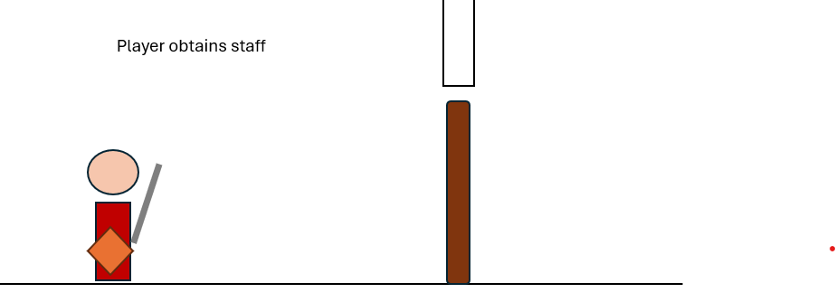
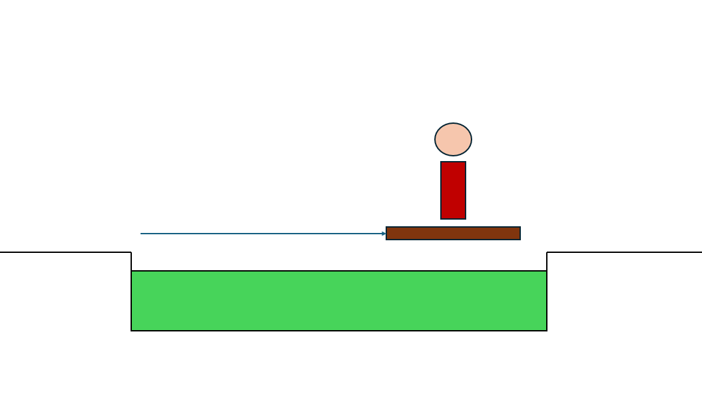
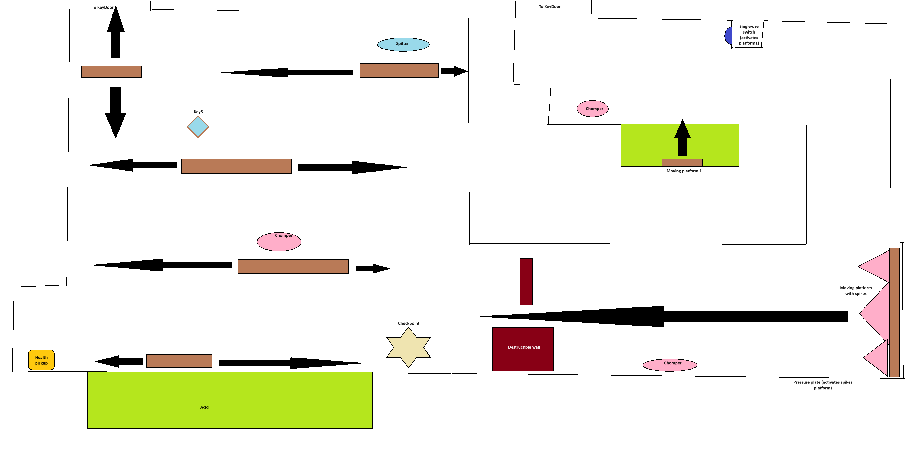

# COMP2150  - Level Design Document
### Name: [Benjamin Fitzgerald]
### Student number: [47631082] 

## 1. Player Experience (~700 words)

### 1.1. Discovery

The player learns to use the provided weapons and interact with the features of the level. The level allows the player to learn by first introducing mechanics in a safe zone before they are used in encounters where they could take damage. This means that the player can first use them without being under pressure
An example of this is the staff pickup, which the player must use to break a destructible pillar before using it to face enemies. This allows the player to understand this new mechanic they’ve been introduced to and then face a challenge using it.

Another example is moving platforms. The first is used simply as an elevator, no risk involved, the second is used to cross spikes and acid, which does involve risk.

### 1.2. Drama
The intensity of this game is carefully plotted to have moments where the player has to be careful but also calm moments in between. The intensity curve of this game is balanced through arrangement of easy and hard encounters. 
An example of an intense encounter is where the player must ride a moving platform and crouch to avoid being knocked off by hanging terrain. Seemly simple at first but then the player realises that they won’t fit under the gap they must react quickly or get knocked down into the spikes. However, when they pass this obstacle a second time, they will already know how to avoid this.

An even better example of this is the moving spikes encounter in scene 3. This shifts from a quite corridor to a high paced moment where the player has to run and clear other obstacles quickly in order to avoid taking damage but at the end is a safe, connective space with a checkpoint where the player can catch their breath. 

### 1.3. Challenge
The main challenges of this game were overcoming obstacles and finding the keys. These challenges are positioned so that the player does not have to overcome them back-to-back, and the encounters that they must repeat are easier the second time around.
One of the toughest challenges I designed was an encounter where the player had to land on a narrow space between two pools of acid. This was frustrating as it was difficult to land on and kept forcing the player to return to the last checkpoint. I widened this a little to maintain flow.

An example of a balanced challenge is the route back from section 2. The player will have to collect the key at the end then return to the door the way they came, but the gun pickup is with the key at the end which makes the return easier, by allowing them to activate single-use switches and take out spitters on ledges. Below shows a player using a switch to activate a moving platform that covers the acid, meaning they don’t have to worry about falling into it.

Another example is the final challenge where players have to jump across a series of moving platforms to reach the third key and the way back to the keydoor. This encounter included a number of obstacles, including chompers, spitters, and spikes, all of which could knock the player down and into the acid.

### 1.4. Exploration
The game invites the player to explore by including more than one route through the level. Even though there is a particular order the player has to complete the encounters, they can check out areas to the side to find health pickups, as well as backtrack through certain parts of the level. I have created distinct spaces by including unique backgrounds that the player can’t interact with but are likely to notice and are memorable.
An example of inviting the player to explore is the path between sections 2 and 3. The player can choose to investigate either section first, but they cannot go further than the first encounter of section 3 until they have obtained the gun by clearing section 2. There is also a scene in section 2 where the player has to work out if the way forward is up a moving platform, or down a passage to the right.

## 2. Core Gameplay (~400 words)

### 2.1. Spikes
These are used as the first obstacle to introduce the jumping mechanic. I chose here because they are the simplest obstacle to begin with.

### 2.2. Passthrough Platforms
These were introduced in the same encounter as the spikes. The player jumps over the second spike to avoid it and lands on top of the passthrough platform, hence discovering another mechanic. 

### 2.3. Weapon Pickup (Staff)
This is given in the second part of the first section. The player first learns how to use it by using it to destroy a pillar blocking their path before using it to fight chompers.

### 2.4. Chompers and Spitters
Immediately after collecting the staff and breaking down the pillar, the player will have two chompers and spitter to face. This is designed to be a simple combat encounter before the player has to face them while also navigating dangerous areas.

### 2.5. Health Pickups
This is included after fighting the first enemies to allow the player to regain any health they may have lost from them or the spikes.

### 2.6. Keys
The first key is placed right before the keydoor, which is reached at the end of the first section. I have chosen to place it here so that when it is collected the player will hopefully notice the first lights on the door turn on, which in turn encourages them to return to this spot once they have collected the remaining keys.

### 2.7 Checkpoints
These will first be used after clearing the first section of the level, at the crossroad between sections 2 and 3. I picked this spot because it is right before encounters involving acid and the player is not forced to repeat section 1. 

### 2.8. Acid
The acid comes into play at the beginning of the second section. First it will be a small pool for the player to jump over, then it gets more complicated using smaller platforms and a spitter.

### 2.9. Moving Platforms
These will first be used in section 2 as a simple elevator and then as a means of the player crossing the acid. 

### 2.10. Weapon Pickup (Gun)
At the end of section 2 the player will pick up the gun next to the key and use it to clear the spitters on the way back. The player will first use it on a switch level with their line of fire, then they must combine it with the jumping and crouching mechanics to hit other targets.

## 3. Spatiotemporal Design

### 3.1. Molecule Diagram

### 3.2. Level Map – Section 1

### 3.3.	Level Map – Section 2

### 3.4.	Level Map – Section 3

## 4. Iterative Design (~400 words)
The iterative design process was used throughout implementing the game. Every encounter was prototyped and tested individually before adding it to the molecule diagram and creating the whole level. This helped by allowing me to determine what ideas worked with the given mechanics in addition to what was too hard and frustrating for the player and what was not. It also helped me come up with ideas for new encounters to fill in the blanks of my design. 
The molecule diagram was also developed iteratively as new ideas were developed, and level design concepts were learnt and applied. 
For example, below is a draft for the second encounter in section 3. It involved activating bridges which dropped pushable block onto the acid for the player to use as stepping stones, but this did not work when I attempted to implement it in Unity because the switch was too far away and the roof was too low for the player to be able to see the blocks and have enough jumping room. I instead compromised by using a single moving platform in the final design.

Here are some other storyboards I developed early in the design process:

These designs were all further improved upon being added to the project.
An encounter that could further be improved using iterative design is the moving platform ladder in section 3. This encounter has already been greater altered compared to the level map above, but still has potential for improvement. This encounter could have several variations that could increase the difficultly, tension, etc. There could be more platforms, more enemies could be placed on them, and the movement patterns could be altered.

## Generative AI Use Acknowledgement
None used

